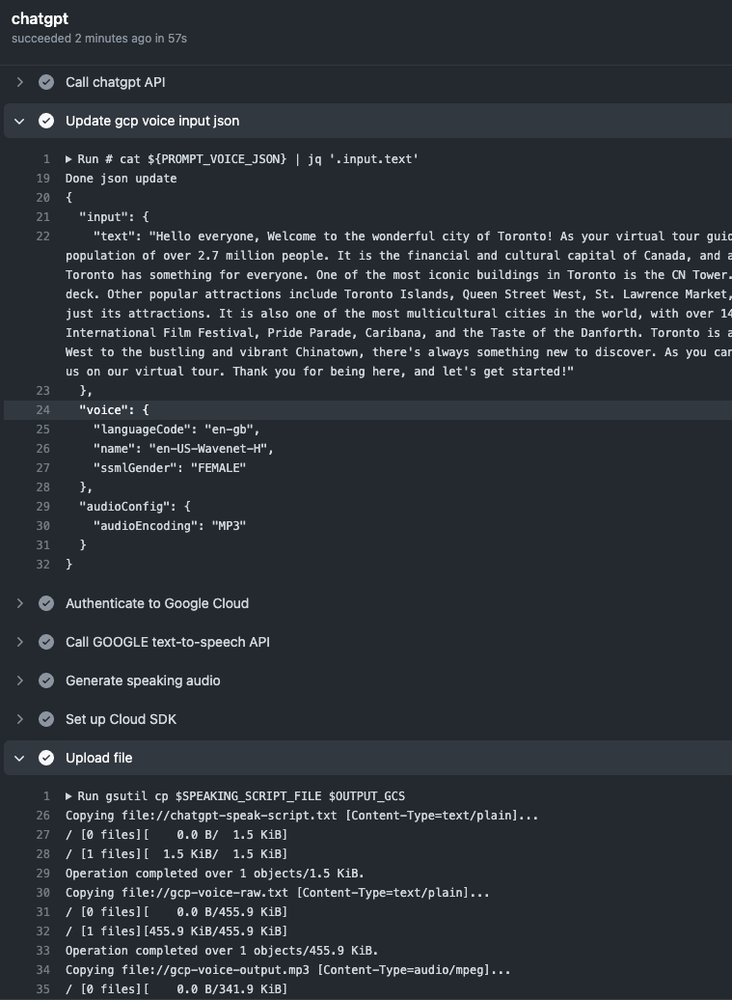

# AIGC CICD Pipeline

## Feature List
 
This is a GitHub Action workflow to demo AIGC, the pipeline has tested below steps:
* Call OpenAI API to generate a speaking script per a prompt request from json input
* Configure Workload Identity Federation to let Github Actions access GCP via OAUTH temporary token
* Generate speaking audio via Google text-to-speech API
* Call Studio.d-id API to generate a talk (mp3) speaking the above script
* Get the url of the saved mp3 file
* Call Video AI API to let the above person speak out the above script

## Preparations
* Generate API key from OPENAI
* [Setup OAUTH to integrate Github Actions with Google AI and Google Cloud Platform](https://github.com/marketplace/actions/authenticate-to-google-cloud#setup)
* [Generate API key from D-ID](https://d-id.readme.io/reference/basic-authentication)
* Create the following secrets to be used in the pipeline

`OPENAI_API_KEY`
> To generate speaking script via ChatGPT API 

`D_ID_API_KEY`
> To generate talk mp3 or video clip from the paid subscription account

`GH_GCP_SERVICE_ACCOUNT`
> To authenticate Github to access Google text-to-speech API and upload files to GCS bucket (need permission `Storage Object Admin`)

`GH_GCP_WORKLOAD_IDENTITY_PROVIDER`
> To auth via Google OAUTH Token
> example: 'projects/123456789/locations/global/workloadIdentityPools/my-pool/providers/my-provider'

## Usage
* Update the prompt text in file `chatgpt/aigc-pipeline/chatgpt_pmt2.json`, the pipeline will be triggered as soon as you commit your code to the `main` branch.
* Access the generated content from the GCS bucket console

## More info and references:
* Example of Prompts: [prompts.md](./prompts.md)
* Generate audio Guide: https://cloud.google.com/text-to-speech/docs/create-audio-text-command-line

## Example of the pipeline output


## Troubleshooting

* If you get below error on Ubuntu, it's caused by showing too much content on stdout via either cat, echo or jq.
```
-bash: /usr/bin/cat: Argument list too long
-bash: /usr/bin/jq: Argument list too long
``` 
**Solution**: To avoid output too much to the stdout, use files for both input and output, parse by jq. Example as below:
```
jq -r '.audioContent' resp-full-gcp-audio.json | base64 -d > $SPEAKING_AUDIO_MP3_FILE
```